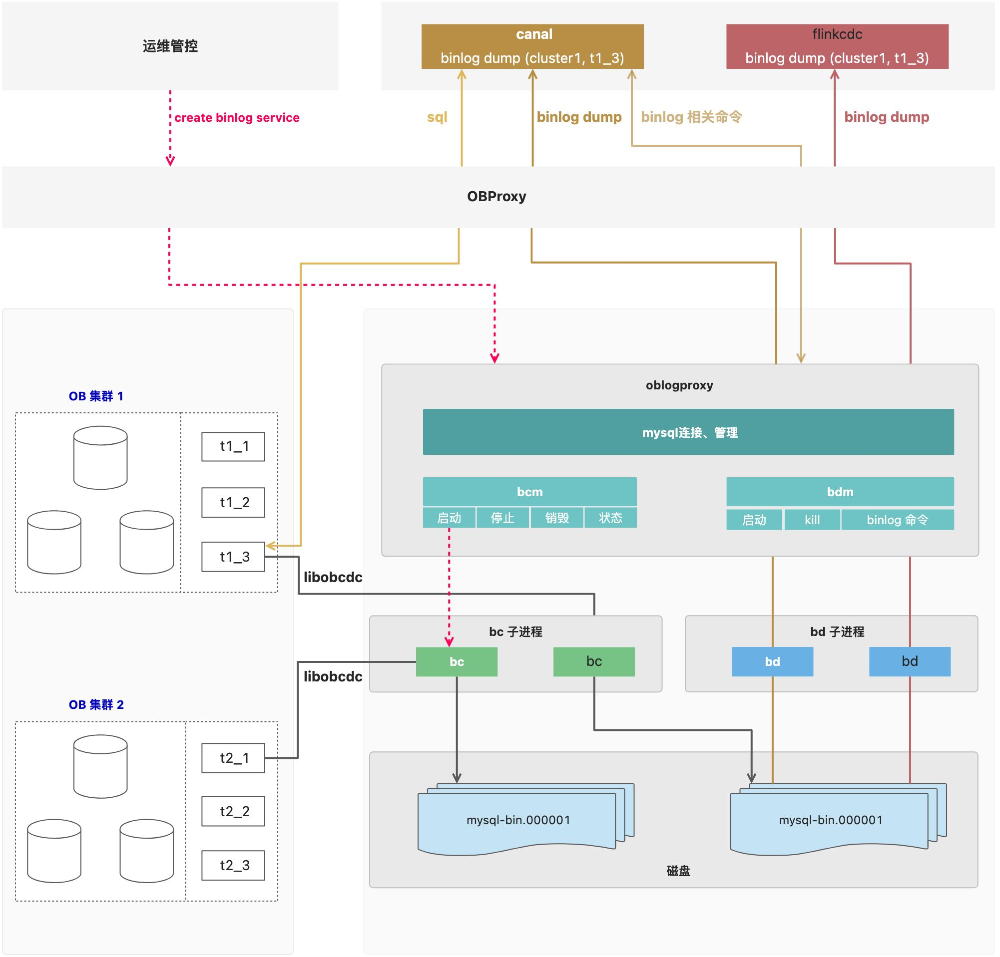
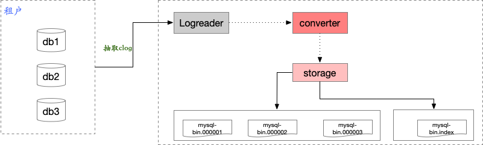
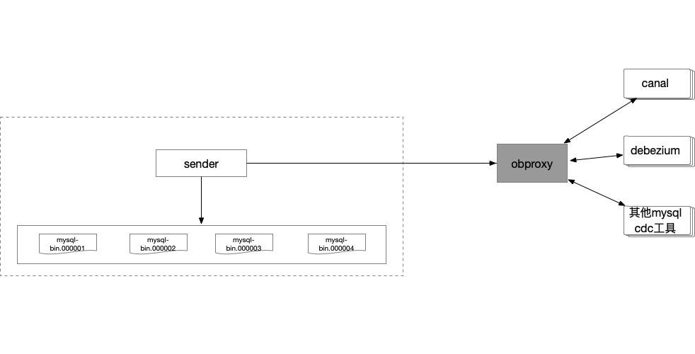

# 基本架构

- **obproxy**: ob 代理服务，sql 和 binlog 都将通过 obproxy 作为统一入口来访问 ob，其中的 binlog 包含了 binlog 相关的命令（如：show
  binlog events;）、binlog replication（即binlog复制协议）
- **oblogproxy**: ob 日志代理服务，提供了 mysql binlog 的兼容能力(包含了 binlog 相关命令和 binlog replication)
- **bc**: oblogproxy 中 binlog converter 子进程，通过 libobcdc 拉取和解析 clog，转换为 binlog 文件
- **bd**: oblogproxy 中 binlog dumper 子进程，对下游（canal or flinkcdc or ...） binlog dump 请求提供 binlog events 订阅服务
- **bcm**:  oblogproxy 中 bc 进程的管理模块
- **bdm**:  oblogproxy 中 bd 进程的管理模块

binlog service 是 oblogproxy 提供的一种模式，当 binlog_mode = true 时，则提供兼容原生 mysql binlog
的服务，包含相关sql、binlog文件生成及binlog dump服务



## bc



## bd



# 版本要求

> **observer版本：>= 4.2.1**
> **obproxy版本： >= 4.2.1**

**支持：**

- **ob 4.2.1 binlog 服务**
- **支持下游订阅**
- **支持集群实例和租户实例**

**已知限制：**

- **ob针对enum、set所实现的拓展语义不支持，比如set定义数支持超过64个、支持重复、enum支持插入未定义数据(比如'')等**
- **varchar(65536)定义不支持**
- **不支持gis类型**

# 功能说明

## 支持范围

### mysql binlog 相关命令

| **命令**                                                                                | 是否支持                             |
|---------------------------------------------------------------------------------------|----------------------------------|
| [show master status](https://dev.mysql.com/doc/refman/5.7/en/show-master-status.html) | 支持                               |
| [show binary logs](https://dev.mysql.com/doc/refman/5.7/en/show-binary-logs.html)     | 支持                               |
| [show binlog events](https://dev.mysql.com/doc/refman/5.7/en/show-binlog-events.html) | 支持                               |
| [purge binary logs](https://dev.mysql.com/doc/refman/5.7/en/purge-binary-logs.html)   | 兼容，但是当前暂不支持客户通过client 清理BInlog文件 |
| [reset master](https://dev.mysql.com/doc/refman/5.7/en/reset-master.html)             |                                  |
| show binlog server                                                                    | 支持                               |

### mysql binlog replication 协议

| 协议                                                                                       | **是否支持** |
|------------------------------------------------------------------------------------------|----------|
| [com_binlog _dump](https://dev.mysql.com/doc/internals/en/com-binlog-dump.html)          | 支持       |
| [com_binlog_dump_gtid](https://dev.mysql.com/doc/internals/en/com-binlog-dump-gtid.html) | 支持       |
| com_register_slave                                                                       | 支持       |

### mysql 相关系统变量

| **系统变量**                                                                                                                                 | **observer 实现说明**   |
|------------------------------------------------------------------------------------------------------------------------------------------|---------------------|
| [binlog_format](https://dev.mysql.com/doc/refman/5.7/en/replication-options-binary-log.html#sysvar_binlog_format)                        | row                 |
| [binlog_row_image](https://dev.mysql.com/doc/refman/5.7/en/replication-options-binary-log.html#sysvar_binlog_row_image)                  | full                |
| [binlog_checksum](https://dev.mysql.com/doc/refman/5.7/en/replication-options-binary-log.html#sysvar_binlog_checksum)                    | crc32               |
| [binlog_rows_query_log_events](https://dev.mysql.com/doc/refman/5.7/en/replication-options-binary-log.html#binlog_rows_query_log_events) | off                 |
| [log_bin](https://dev.mysql.com/doc/refman/5.7/en/replication-options-binary-log.html#sysvar_log_bin)                                    | on                  |
| [server_id](https://dev.mysql.com/doc/refman/5.7/en/replication-options.html#sysvar_server_id)                                           | 大于 0 整数，租户创建后该值保持不变 |
| [server_uuid](https://dev.mysql.com/doc/refman/5.7/en/replication-options.html#sysvar_server_uuid)                                       | 租户创建后该值应保持不变        |

## 限制说明

### sql兼容性

ob的ddl语法与mysql ddl语法存在一定的差异性，即ob有自己的一些拓展语法，因此有部分ddl语法可能无法解析。
> 为解决这种问题observer做了兼容性支持，建议obproxy设置 init_sql 开启`_show_ddl_in_compat_mode`
> ，开启后observer `show create table`输出会完全兼容mysql的语法，建议设置为租户级别。

# 使用步骤

## 准备工作

### 版本要求

> **observer版本：>= 4.2.1**
> **obproxy版本： >= 4.2.1**
> **oblogproxy版本：>= 2.0.0**

### obproxy参数配置

从基本架构可以看出，binlog 下游订阅服务实际交互时是与 obproxy 直接交互的（这点跟 mysql 需保持一致，否则就无法做到兼容 mysql
binlog），不感知 oblogproxy（真正提供的 binlog service 服务的组件），下游的请求是由 obproxy 转发给 observer 或 oblogproxy，因此在
obproxy 需配置 oblogproxy 的服务地址。

```sql
-- 1.用sys账号连接到obproxy
mysql -h xxx.xxx.xxx.xxx -P 2883 -uroot@sys#xxx -D oceanbase -A -p'password'

-- 2.查询binlog server 地址
MySQL [oceanbase]> show proxyconfig like 'binlog_service_ip';
+-------------------+--------------------+-----------------------------------------+-------------+---------------+
| name              | value              | info                                    | need_reboot | visible_level |
+-------------------+--------------------+-----------------------------------------+-------------+---------------+
| binlog_service_ip | xxx.xxx.xx.xx:port | binlog service ip, format ip1:sql_port1 | false       | SYS           |
+-------------------+--------------------+-----------------------------------------+-------------+---------------+
1 row in set (0.00 sec)

--3.配置binlog server 地址,地址形式为ip:port
mysql > alter proxyconfig set binlog_service_ip='ip:port';

--4.开启binlog服务的转发
mysql > alter proxyconfig set enable_binlog_service='True';

--5.设置init_sql,可以设置通过该obproxy的session链接都在session级别设置一些系统变量
mysql > alter proxyconfig set init_sql='set _show_ddl_in_compat_mode = 1;';
```

### oblogproxy参数配置

#### 参数说明

| 字段                                 | 默认值                                                          | 说明                                                                                      |
|------------------------------------|--------------------------------------------------------------|-----------------------------------------------------------------------------------------|
| service_port                       | 2983                                                         | 服务端口                                                                                    |
| encode_threadpool_size             | 8                                                            | 编码线程池初始化大小                                                                              |
| encode_queue_size                  | 20000                                                        | 编码线程队列长度                                                                                |
| max_packet_bytes                   | 67108864                                                     | 最大数据包字节数                                                                                |
| record_queue_size                  | 20000                                                        | 数据发送队列长度                                                                                |
| read_timeout_us                    | 2000000                                                      | 数据读取队列批次等待周期，单位微秒                                                                       |
| read_fail_interval_us              | 1000000                                                      | 数据读取队列重试等待周期，单位微秒                                                                       |
| read_wait_num                      | 20000                                                        | 数据读取队列批次等待数量                                                                            |
| send_timeout_us                    | 2000000                                                      | 发送数据包超时，单位微秒                                                                            |
| send_fail_interval_us              | 1000000                                                      | 发送数据包失败重试等待周期，单位微秒                                                                      |
| command_timeout_s                  | 10                                                           | 命令执行超时，单位微妙                                                                             |
| log_quota_size_mb                  | 5120                                                         | 日志文件总大小阈值，单位MB                                                                          |
| log_quota_day                      | 7                                                            | 日志文件存储时间阈值，单位天                                                                          |
| log_gc_interval_s                  | 43200                                                        | 日志文件清理周期，单位秒                                                                            |
| oblogreader_path_retain_hour       | 168                                                          | oblogreader子进程目录保留时间，单位小时                                                               |
| oblogreader_lease_s                | 300                                                          | oblogreader子进程启动探测时间，单位秒                                                                |
| oblogreader_path                   | /usr/local/oblogproxy/run                                    | oblogreader子进程上下文目录根路径，此处为绝对路径，例如/usr/local/oblogproxy/run                              |
| bin_path                           | /usr/local/oblogproxy/bin                                    | 项目bin目录，此处为绝对路径，例如/usr/local/oblogproxy/bin                                             |
| oblogreader_obcdc_ce_path_template | /usr/local/oblogproxy/obcdc/obcdc-ce-%d.x-access/libobcdc.so | oblogreader依赖库目录，此处为绝对路径，例如/usr/local/oblogproxy/obcdc/obcdc-ce-%d.x-access/libobcdc.so |
| allow_all_tenant                   | true                                                         | 是否允许订阅所有租户                                                                              |
| auth_user                          | true                                                         | 是否鉴权连接用户                                                                                |
| auth_use_rs                        | false                                                        | 是否通过root server鉴权用户                                                                     |
| auth_allow_sys_user                | true                                                         | 是否允许订阅系统租户                                                                              |
| ob_sys_username                    | ""                                                           | 【必须自行配置】系统租户用户名密文，用来订阅增量                                                                |
| ob_sys_password                    | ""                                                           | 【必须自行配置】系统租户密码密文，用来订阅增量                                                                 |
| counter_interval_s                 | 2                                                            | 计数器周期，单位秒                                                                               |
| metric_enable                      | true                                                         | 是否开启指标采集（资源消耗，CPU、内存、网络）                                                                |
| metric_interval_s                  | 10                                                           | 指标采集周期                                                                                  |
| debug                              | false                                                        | 打印debug信息                                                                               |
| verbose                            | false                                                        | 打印更多debug信息                                                                             |
| verbose_packet                     | false                                                        | 打印数据包信息                                                                                 |
| readonly                           | false                                                        | 只读模式                                                                                    |
| channel_type                       | plain                                                        | 链路类型                                                                                    |
| tls_ca_cert_file                   | ""                                                           | CA证书文件路径（绝对路径）                                                                          |
| tls_cert_file                      | ""                                                           | 服务器端签名证书路径（绝对路径）                                                                        |
| tls_key_file                       | ""                                                           | 服务器端的私钥路径（绝对路径）                                                                         |
| tls_verify_peer                    | true                                                         | 开启oblogclient验证                                                                         |
| liboblog_tls                       | false                                                        | 开启与ObServer通信的TLS                                                                       |
| liboblog_tls_cert_path             | ""                                                           | ObServer相关证书文件路径（绝对路径）                                                                  |
| binlog_log_bin_basename            | /usr/local/oblogproxy/run                                    | binlog 文件生成的默认路径，此次为绝对路径，例如/usr/local/oblogproxy/run                                    |
| binlog_obcdc_ce_path_template      | /usr/local/oblogproxy/obcdc/obcdc-ce-%d.x-access/libobcdc.so | binlog依赖库路径目录，此处为绝对路径，例如/usr/local/oblogproxy/obcdc/obcdc-ce-%d.x-access/libobcdc.so    |
| binlog_ignore_unsupported_event    | true                                                         | 是否跳过不支持转换的event                                                                         |
| binlog_max_event_buffer_bytes      | 67108864                                                     | binlog events 转换的buffer大小                                                               |
| binlog_mode                        | true                                                         | 是否开启binlog转换模式，需开启                                                                      |
| table_whitelist                    | ”“                                                           | for test,可以指定binlog转换的白名单                                                               |
| binlog_nof_work_threads            | 16                                                           | 处理非BC调度请求的线程池大小，比如处理binlog查询相关，show binary logs等                                        |
| binlog_bc_work_threads             | 2                                                            | 处理BC 调度请求线程池大小，例如开启binlog converter、停止等                                                 |
| binlog_max_file_size_bytes         | 524288000                                                    | 单个binlog文件的大小                                                                           |
| binlog_convert_timeout_us          | 10000                                                        | 转换超时时间                                                                                  |
| binlog_checksum                    | true                                                         | 是否开启binlog checksum                                                                     |
| binlog_heartbeat_interval_us       | 1000000                                                      | 心跳事件发送周期                                                                                |

#### 示例

参数配置在 conf/conf.json 配置文件中，如下：

```json
{
  "service_port": 2983,
  "encode_threadpool_size": 8,
  "encode_queue_size": 20000,
  "max_packet_bytes": 67108864,
  "record_queue_size": 20000,
  "read_timeout_us": 2000000,
  "read_fail_interval_us": 1000000,
  "read_wait_num": 20000,
  "send_timeout_us": 2000000,
  "send_fail_interval_us": 1000000,
  "check_quota_enable": false,
  "check_clog_enable": true,
  "command_timeout_s": 10,
  "log_quota_size_mb": 5120,
  "log_quota_day": 7,
  "log_gc_interval_s": 43200,
  "log_level": 2,
  "loh_flush_strategy": 1,
  "log_flush_level": 2,
  "log_flush_period_s": 1,
  "log_max_file_size_mb": 1024,
  "log_retention_h": 360,
  "oblogreader_path_retain_hour": 168,
  "oblogreader_lease_s": 300,
  "oblogreader_path": "/usr/local/oblogproxy/run",
  "bin_path": "/usr/local/oblogproxy/bin",
  "oblogreader_obcdc_ce_path_template": "/usr/local/oblogproxy/obcdc/obcdc-ce-%d.x-access/libobcdc.so",
  "allow_all_tenant": true,
  "auth_user": true,
  "auth_use_rs": false,
  "auth_allow_sys_user": true,
  "ob_sys_username": "",
  "ob_sys_password": "",
  "counter_interval_s": 2,
  "metric_enable": true,
  "metric_interval_s": 10,
  "debug": false,
  "verbose": false,
  "verbose_packet": false,
  "verbose_record_read": false,
  "readonly": false,
  "count_record": false,
  "channel_type": "plain",
  "tls_ca_cert_file": "",
  "tls_cert_file": "",
  "tls_key_file": "",
  "tls_verify_peer": true,
  "liboblog_tls": false,
  "liboblog_tls_cert_path": "",
  "binlog_log_bin_basename": "/usr/local/oblogproxy/run",
  "binlog_obcdc_ce_path_template": "/usr/local/oblogproxy/obcdc/obcdc-ce-%d.x-access/libobcdc.so",
  "binlog_ignore_unsupported_event": true,
  "binlog_max_event_buffer_bytes": 67108864,
  "binlog_mode": false,
  "table_whitelist": "",
  "binlog_nof_work_threads": 16,
  "binlog_bc_work_threads": 2,
  "binlog_max_file_size_bytes": 524288000,
  "binlog_convert_timeout_us": 10000,
  "binlog_checksum": true,
  "binlog_heartbeat_interval_us": 100000,
  "binlog_gtid_display": true,
  "binlog_memory_limit": "3G",
  "binlog_working_mode": "storage",
  "binlog_recover_backup": true
}
```

# 部署启动

oblogproxy现提供rpm包，可以从[github](https://github.com/oceanbase/oblogproxy/releases)
进行下载，也可从[oceanbase社区](https://www.oceanbase.com/softwarecenter)进行下载

### 部署服务

```shell
rpm -i oblogproxy-xxxxx.el7.x86_64.rpm

cd /usr/local/oblogproxy

# 修改配置文件
vim conf/conf.json

# 需要修改下面三项配置, 修改后保存退出
"binlog_mode": true
"bin_path": "/usr/local/oblogproxy/bin"
"binlog_log_bin_basename": "/usr/local/oblogproxy/run"
"binlog_obcdc_ce_path_template": "/usr/local/oblogproxy/obcdc/obcdc-ce-%d.x-access/libobcdc.so"
# /usr/local/oblogproxy/ 为项目绝对路径

# ${sys_usr} ob系统租户账号 ${sys_pwd} ob系统租户密码
# config_sys 为 run.sh 调用函数, 作用将账密进行加密，密文保存到 conf/conf.json 中
./run.sh config_sys ${sys_usr} ${sys_pwd}
# start 启动 oblogproxy 服务进程
./run.sh start
```

### binlog开启

#### 语法说明

```sql
CREATE BINLOG [IF NOT EXISTS] FOR TENANT `cluster`.`tenant` [TO USER `user` PASSWORD `pwd`] [FROM <timestamp>] WITH CLUSTER URL `<cluster url>`[, INITIAL_TRX_XID `ob_txn_id`, INITIAL_TRX_GTID_SEQ `gtid_seq`];

-- 支持对binlog服务指定账户名与密码(用于订阅OB日志，4.x可以指定为业务租户)
[TO USER `user` PASSWORD `pwd`]

-- 支持指定oceanbase的事务id与binlog的gitd做映射
-- INITIAL_TRX_XID:ob的事务id
-- INITIAL_TRX_GTID_SEQ:映射的gitd seq
[, INITIAL_TRX_XID `ob_txn_id`, INITIAL_TRX_GTID_SEQ `gtid_seq`]

-- 示例:
CREATE BINLOG FOR TENANT `cluster`.`tenant` TO USER `user` PASSWORD `pwd` FROM 1668339370000000 WITH CLUSTER URL 'cluster_url', SERVER UUID '2340778c-7464-11ed-a721-7cd30abc99b4', INITIAL_TRX_XID '97984179', INITIAL_TRX_GTID_SEQ '31';
```

#### 使用说明

**注意：binlog 开启 sql 要直连 logproxy 服务执行。**
由于`CREATE BINLOG`并不是 mysql sql，因此该 sql 仅支持直连 logproxy 服务执行。

#### 示例

```sql
-- 127.0.0.1 2983 是 oblogproxy ip + port
mysql -A -c -h 127.0.0.1 -P 2983

-- 创建Binlog 服务，cluster url可以通过show parameters like '%url%' 在集群中查询
CREATE BINLOG FOR TENANT `test_cluster`.`test_tenant` WITH CLUSTER URL `clustet_url`";

-- 指定起始时间戳创建 binlog 服务, 微妙级时间戳
CREATE BINLOG FOR TENANT `test_cluster`.`test_tenant` FROM 1668339370000000 WITH CLUSTER URL `clustet_url`,SERVER UUID `xxxxx`;
```

### 其他运维操作

#### 创建binlog服务

```sql
CREATE BINLOG [IF NOT EXISTS] FOR TENANT `cluster`.`tenant` [FROM <timestamp>] WITH CLUSTER URL `<cluster url>`;
```

#### 释放binlog服务

```sql
DROP BINLOG [IF EXISTS] FOR TENANT `cluster`.`tenant`;
```

#### 获取binlog服务状态

查询当前租户下的磁盘占用及服务状态，指定租户时返回该租户对应的信息。不指定租户时则返回当前集群所有binlog 服务状态。

```sql
SHOW BINLOG STATUS [FOR TENANT `cluster`.`tenant`];
```

#### 清理binlog日志

```sql
PURGE BINARY LOGS BEFORE '2019-04-02 22:46:26' [FOR TENANT `cluster`.`tenant`];
PURGE BINARY LOGS TO 'mysql-bin.000001' [FOR TENANT `cluster`.`tenant`];
```

### binlog相关命令

#### show binary logs

```sql
MySQL [(none)]> show binary logs;
+------------------+-----------+
| Log_name         | File_size |
+------------------+-----------+
| mysql-bin.000001 | 172725907 |
+------------------+-----------+
1 row in set (0.08 sec)
```

#### show master status

```sql
MySQL [(none)]> show master status;
+------------------+-----------+--------------+------------------+--------------------------------------------+
| File             | Position  | Binlog_Do_DB | Binlog_Ignore_DB | Executed_Gtid_Set                          |
+------------------+-----------+--------------+------------------+--------------------------------------------+
| mysql-bin.000001 | 172725907 |              |                  | d7c4993b-581f-11ee-8312-00163e041ea4:1-239 |
+------------------+-----------+--------------+------------------+--------------------------------------------+
1 row in set (0.00 sec)
```

#### show binlog events

```sql
MySQL [(none)]> show binlog events;
```

展示太多，此处略
