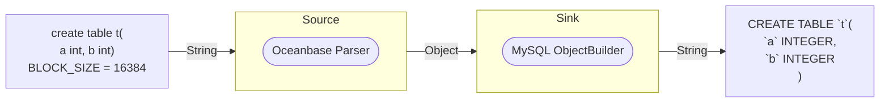

# etransfer-cpp

etransfer-cpp is a DDL conversion tool, it is currently used to convert DDL statements from OceanBase MySQL mode to MySQL fully compatible DDL statements.

## Overview

The following picture shows how etransfer-cpp works.


The etransfer-cpp includes two stages: source and sink. In the source stage, DDL statements in OceanBase MySQL mode are parsed to intermediate Object (such as CreateTableObject) based on antlr4. In the sink stage, the intermediate Object is built into MySQL fully compatible DDL statements.

## Build

### Prerequisites

* The minimum C++ version to compile the etransfer-cpp is C++17.
* Java 11 is required to generate grammar parser code.

### Build etransfer-cpp
```
cd etransfer-cpp
mkdir -p build
cd build
cmake ..
make
```

## Usage

etransfer-cpp can be used as library in your project. The example code can be found at [example code](/example/example_main.cpp).
